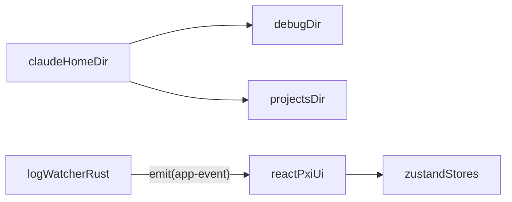

# Agents Office

Claude Code가 작업하는 과정을 **사무실 속 에이전트(Researcher/Coder/Reviewer/Manager)**로 시각화하는 Tauri 데스크톱 앱입니다.  
로컬의 Claude 로그(`$HOME/.claude/**`)를 감시(watch)하고, 이벤트를 프론트엔드(PixiJS 캔버스 + Inbox 로그 패널)로 스트리밍합니다.


## 주요 기능
- **에이전트 시각화**: 상태(Idle/Working/Thinking/Passing/Error)를 픽셀 아트 스타일로 표시
- **Inbox 로그**: Claude 로그 라인을 `LogEntry`로 파싱해 최근 항목을 표시(최대 100개)
- **Watcher 상태 표시**: `Watching/Idle`, 세션 ID 표시(이벤트 기반)

## 요구사항
- **Node.js**: 18 이상 권장
- **Rust**: stable toolchain
- **Tauri prerequisites**: OS별 빌드 의존성 설치가 필요합니다. 자세한 내용은 [Tauri prerequisites](https://tauri.app/start/prerequisites/)를 참고하세요.

## 실행 방법

### 0) npx로 바로 실행 (macOS, 권장)

로컬에 Rust/Tauri 툴체인 없이도 아래 명령으로 앱을 실행할 수 있습니다.  
실제 앱 바이너리는 GitHub Releases에서 다운로드되며, 한 번 다운로드되면 캐시에 저장되어 다음 실행은 빨라집니다.

```bash
npx @j-ho/agents-office
```

- **버전 고정 실행**:

```bash
npx @j-ho/agents-office --version 0.1.2
```

- **캐시 강제 갱신**:

```bash
npx @j-ho/agents-office --force
```

#### Gatekeeper 주의사항 (macOS)
다운로드된 앱이 차단되면 **System Settings → Privacy & Security**에서 “Open Anyway(또는 허용)”를 선택해야 할 수 있습니다.

### 1) 의존성 설치

```bash
npm install
```

### 2) 웹(브라우저)로 개발 실행

```bash
npm run dev
```

### 3) 데스크톱(Tauri)로 개발 실행

```bash
npm run tauri:dev
```

## 빌드

### 웹 빌드

```bash
npm run build
```

### 데스크톱(Tauri) 빌드

```bash
npm run tauri:build
```

## 권한/보안 (중요)
이 앱은 Claude 로그를 읽기 위해 Tauri capability로 **로컬 파일 읽기 권한**을 사용합니다.

- **읽는 경로**: `$HOME/.claude/**`
  - 주로 `$HOME/.claude/debug`, `$HOME/.claude/projects` 하위를 감시합니다.
- **읽는 파일 유형**: `.txt`, `.jsonl`, `.json`
- **동작 방식**: 파일의 “새로 추가된 줄”만 읽어 프론트로 이벤트를 emit 합니다.
- **주의**: 로그에 민감 정보가 포함될 수 있습니다. 앱은 로컬에서만 처리하지만, 화면 공유/스크린샷에 포함되지 않도록 주의하세요.

관련 설정은 [`src-tauri/capabilities/default.json`](./src-tauri/capabilities/default.json)에서 확인할 수 있습니다.

## 아키텍처 개요



### 이벤트 흐름(요약)
- Rust 워처가 파일 변경을 감지하고 로그 라인을 파싱
- `app-event`로 프론트에 이벤트 전송
  - `LogEntry`: Inbox 로그 추가
  - `AgentUpdate`: 에이전트 상태/업무 표시 갱신
  - `WatcherStatus`: 상단 상태(Watching/Idle) 갱신

## 릴리스 자산 규격 (npx 실행용)
`npx @j-ho/agents-office`는 GitHub Releases(`awesomelon/agents-office`)에서 macOS 빌드 산출물을 다운로드합니다.

- **태그 규칙**: `vX.Y.Z` (예: `v0.1.2`)
- **권장 자산 이름**: `Agents-Office-macos.zip`
  - zip 내부에 `Agents Office.app/` 번들이 포함되어 있어야 합니다.
- (선택) 무결성 검증:
  - `Agents-Office-macos.zip.sha256` 또는 `checksums.txt`를 함께 업로드하면 CLI가 sha256 검증을 수행합니다.

## 라이선스
MIT

