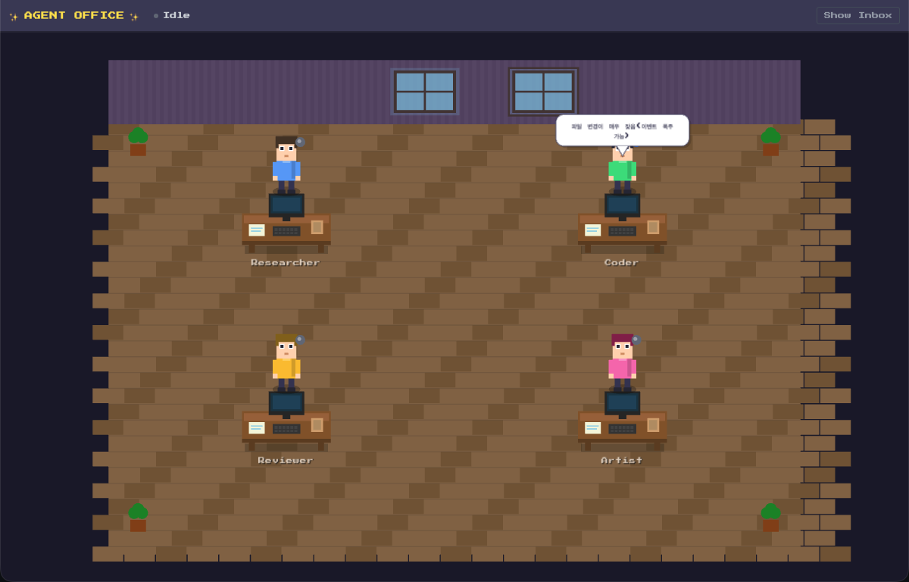
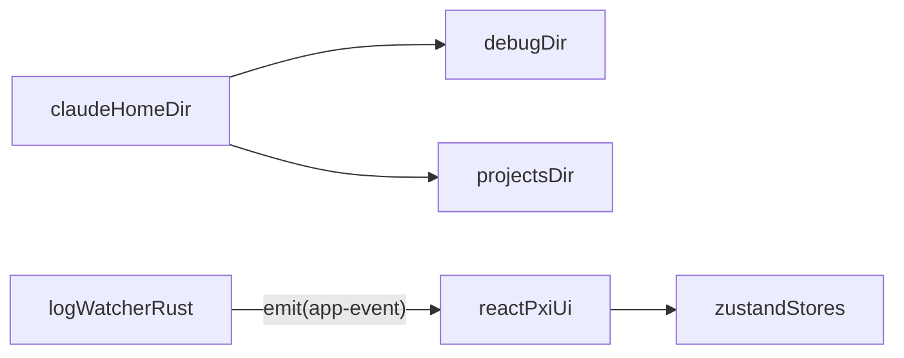

# Agents Office

A Tauri desktop app that visualizes Claude Code's workflow as **office agents (Reader/Searcher/Writer/Editor/Runner/Tester/Planner/Support)** working in a pixel art office.
It watches local Claude logs (`$HOME/.claude/**`) and streams events to the frontend (PixiJS canvas + Inbox log panel).



## Key Features
- **Agent Visualization**: Displays agent states (Idle/Working/Thinking/Passing/Error) in pixel art style
- **Inbox Log**: Parses Claude log lines into `LogEntry` and displays recent items (up to 100)
- **Watcher Status**: Shows `Watching/Idle` status and session ID (event-based)

## Agent UI Legend (Expressions/Icons)

### Agent Types (Roles) & Colors
- **Reader**: Reads and summarizes input/file content (color `#60A5FA`)
- **Searcher**: Performs code/file/web searches (color `#38BDF8`)
- **Writer**: Creates new files/code (color `#4ADE80`)
- **Editor**: Modifies existing code (color `#22C55E`)
- **Runner**: Handles command execution (general Bash, etc.) (color `#FBBF24`)
- **Tester**: Handles test/build/validation execution (color `#F97316`)
- **Planner**: Manages todo/planning and task delegation (color `#F472B6`)
- **Support**: User questions/assistance role (color `#A78BFA`)

### Status (Idle/Working/Thinking/Passing/Error) Display
- **Status Indicator (dot next to head)**: Color changes based on status
  - `idle`: `#6B7280`
  - `working`: `#22C55E`
  - `thinking`: `#3B82F6`
  - `passing`: `#A855F7`
  - `error`: `#EF4444`
- **Error Badge**: Red exclamation badge appears above head when in `error` state
- **Desk Monitor Screen**
  - `idle`: Dark screen + scanlines
  - `working`: Agent-colored code lines scrolling + cursor blinking
  - `thinking`: Loading dots (3) + icon (circular "brain/gear" style)
  - `passing`: Right-moving arrow + transfer icon
  - `error`: Red flash + X mark

### Expression (Mood) Display
Expressions are separate from "status" - eyes/eyebrows/mouth area change based on mood.
- **neutral**: Default expression
- **focused**: Concentrated state from recent tool call (slightly lowered eyebrows, slight smile)
- **stressed**: Tense state after/during error (worried eyebrows + sweat drop)
- **blocked**: Blocked state from rate limit, etc. (closed eyes + Z mark)

### Error/Rate Limit (Waiting) Additional Display
- **Red Warning Light**: When an error is detected, the warning light next to the desk blinks
- **"On Vacation" Sign + Wait Indicator**: When blocked by rate limit, displays "On Vacation" sign with hourglass/dots (waiting)

### Speech Bubble (Task Summary)
- Speech bubble appears when not `idle`, showing tool call name summarized (e.g., `Read` → "Reading file")
- Long text is truncated, and bubble auto-hides after no updates for a period

## Requirements
- **Node.js**: 18 or higher recommended
- **Rust**: stable toolchain
- **Tauri prerequisites**: OS-specific build dependencies required. See [Tauri prerequisites](https://tauri.app/start/prerequisites/) for details.

## Running the App

### 0) Run directly with npx (macOS, recommended)

You can run the app without local Rust/Tauri toolchain using the command below.
The actual app binary is downloaded from GitHub Releases and cached for faster subsequent runs.

```bash
npx @j-ho/agents-office
```

- **Pin specific version**:

```bash
npx @j-ho/agents-office --version 0.1.2
```

- **Force cache refresh**:

```bash
npx @j-ho/agents-office --force
```

#### Gatekeeper Note (macOS)
If the downloaded app is blocked, you may need to select "Open Anyway" in **System Settings → Privacy & Security**.

### 1) Install Dependencies

```bash
npm install
```

### 2) Run in Browser (Development)

```bash
npm run dev
```

### 3) Run as Desktop App (Tauri Development)

```bash
npm run tauri:dev
```

## Build

### Web Build

```bash
npm run build
```

### Desktop (Tauri) Build

```bash
npm run tauri:build
```

## Permissions/Security (Important)
This app uses Tauri capabilities for **local file read permissions** to access Claude logs.

- **Paths accessed**: `$HOME/.claude/**`
  - Primarily watches `$HOME/.claude/debug` and `$HOME/.claude/projects` subdirectories
- **File types read**: `.txt`, `.jsonl`, `.json`
- **Behavior**: Only reads "newly added lines" from files and emits events to the frontend
- **Note**: Logs may contain sensitive information. The app processes locally only, but be careful not to include in screen shares/screenshots.

Related settings can be found in [`src-tauri/capabilities/default.json`](./src-tauri/capabilities/default.json).

## Architecture Overview



### Event Flow (Summary)
- Rust watcher detects file changes and parses log lines
- Sends events to frontend via `app-event`
  - `LogEntry`: Add inbox log entry
  - `AgentUpdate`: Update agent status/task display
  - `WatcherStatus`: Update top status (Watching/Idle)

## Release Asset Specification (for npx execution)
`npx @j-ho/agents-office` downloads macOS build artifacts from GitHub Releases (`awesomelon/agents-office`).

- **Tag convention**: `vX.Y.Z` (e.g., `v0.1.2`)
- **Recommended asset name**: `Agents-Office-macos.zip`
  - The zip should contain `Agents Office.app/` bundle inside
- (Optional) Integrity verification:
  - Upload `Agents-Office-macos.zip.sha256` or `checksums.txt` alongside for CLI sha256 verification

## License
MIT
