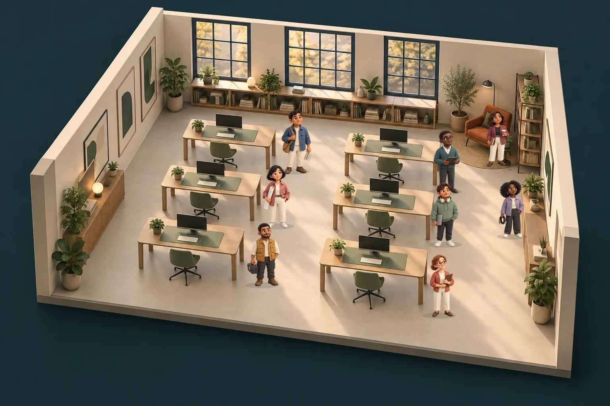

# 3D characters in the Codex studio

The studio now displays eight distinct teammates in the room, replacing its
numbered location pins. Their matte materials, warm light and muted clothing
match the existing office. Six stand beside work desks; Liaison occupies the
lounge and Connector the floor in front of the resource shelving.

This preview is a local composition of the actual bundled room and character
images, sorted by the same foot anchors used by the app. It is not a browser
screenshot and does not show the app's controls, motion or live status.

## Integrated behavior

- All eight characters remain visible when idle. They illustrate roles, not a
  count of running Codex agents. Observed records drive status.
- Selecting a character or its directory portrait opens that role's recent
  events and suspends automatic following. Follow activity resumes following.
- The directory and selected-role header use portraits of the same characters.
- Working, thinking and passing states have distinct restrained CSS motion.
  Errors use an exclamation badge; rate limits use a pause badge and explicit
  text. The same character stays mounted through status changes.
- Motion off, system reduced motion and hidden tabs stop character animation.
- Scene controls have 44px minimum targets. Below a 560px scene width or 600px
  viewport, the characters remain visible and the full-size directory provides
  selection. Scene targets are removed from interaction and keyboard order.
- A failed character image falls back to initials without disabling selection.
  A failed room image leaves the role directory and event panel usable.

## Implementation and review

`studioAgents.ts` owns local image paths and percentage foot anchors on the full
3:2 room canvas. `StudioCharacter` supplies status, selection and depth ordering;
`StudioAvatar` reuses the asset in scene and portrait sizes. No runtime dependency
or WebGL requirement was added. Pixel view remains available.

The eight 384 × 384 sprites total about 196 KiB and are reused through browser
caching. The full atlas and this documentation preview are not loaded by the UI.
See [asset provenance](../public/assets/agents/README.md).

Visual inspection of the local composition corrected the library character's
floor placement and separated the lounge/research targets. A geometry check at
scene widths 561, 640, 1000 and 1536px found no overlapping character targets.
This calculation does not replace runtime reflow or focus verification.

Focused interaction tests cover distinct identities, keyboard character
selection, preserving manual selection during new observations, work/error/rate
limit/recovery, image fallback and switching away from a failed portrait. Existing
tests cover following, view switching, reduced motion and paused animation while
records continue arriving. Run `npm run check` and `npm run test:core`.

Cloud-browser navigation was rejected by automatic approval review because
opening a local Codex viewer in an external browser could expose session-derived
data. No local session data was accessed for this preview. Browser and native
macOS visual acceptance remain outstanding: inspect desktop and narrow layouts,
focus rings, portrait crops, status motion and reduced motion in the running app.
